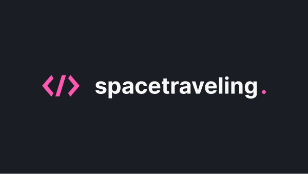
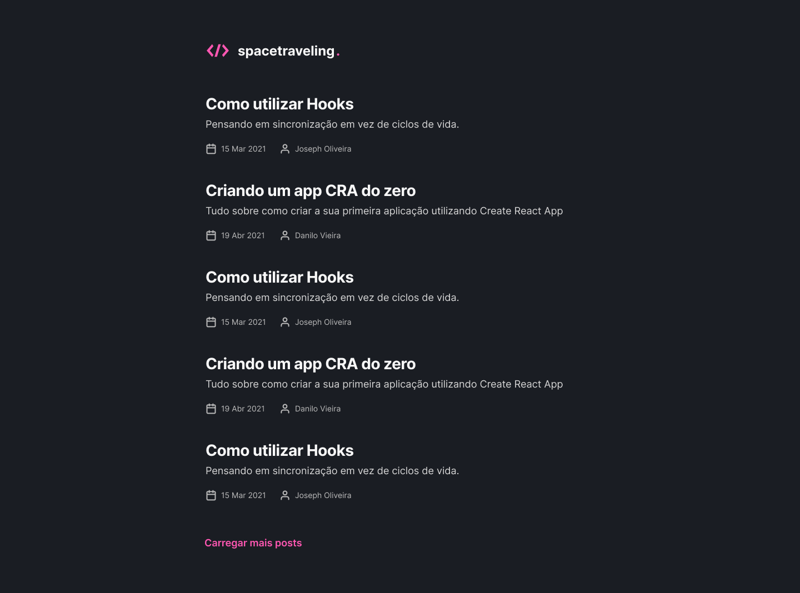
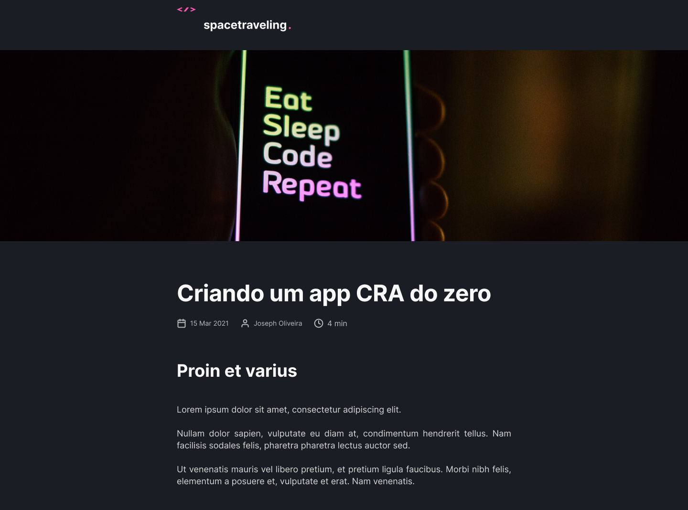

<h1 align="center">


</h1>

<p align="center">

  

  <a href="https://github.com/araujo-jp">
    
  </a>

  <a href="https://github.com/araujo-jp/SpaceTraveling/commits/main">
    
  </a>

  
</p>


## 🚀 Sobre ##

O projeto tem como objetivo o estudo e desenvolvimento de uma aplicação em ReactJS com NextJS para listagem de posts de um blog.

A aplicação foi desenvolvida utilizando o framework NextJS aplicando os conceitos de Static Site Generation (SSG) e utilizando Prismic CMS para adição e gerenciamento do conteúdo dos posts.

Como desafio complementar foi adicionado sessão de comentários utilizando Utterances, acesso a Preview dos posts do Prismic CMS, controle de navegação dentro do post para ir para o próximo/anterior e adição de tag com data de quando o post sofreu a ultima edição.

---

## 🧪 Tecnologias ##

As seguintes tecnologias foram utilizadas no projeto:

- [Next.js](https://nextjs.org/)
- [TypeScript](https://www.typescriptlang.org/)
- [Sass](https://sass-lang.com/)
- [Prismic CMS](https://prismic.io/)

## ✔️ Pré-requisitos ##

Antes de começar, você vai precisar ter instalado em sua máquina as seguintes ferramentas:

- [Node JS](https://nodejs.org/)
- [Yarn](https://yarnpkg.com/lang/)

## ⚒️ Rodando a aplicação ##

```bash
# Clone this project
$ git clone https://github.com/araujo-jp/SpaceTraveling.git

# Access
$ cd SpaceTraveling

# Install dependencies
$ yarn install

# Run the project
$ yarn dev

# The server will initialize in the http://localhost:3000
```

## 📝 Licença ##

Esse projeto está sob a licença MIT. Veja o arquivo [LICENSE](./LICENSE) para mais detalhes.


## 🖼️ Imagens ##

<h1 align="center">
    
    
    
</h1>

<p align="center">Feito com :heart: by João Paulo Araújo 👋🏻</p>
